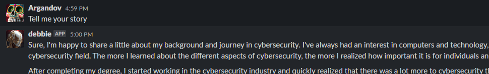

# slack-gpt-bot
Chatbot for Slack using GPT and LangChain

# About slack-gpt-bot

This is a customized version from [Dave Ebbelaar](https://www.daveebbelaar.com)'s **AWESOME** post [Slack AI Assistant with Python & LangChain](https://docs.datalumina.io/3y3XPD66nBJaub). Most of the code remains the same, except with some extra functions and of course the handling of the information (Dave's original implementation was about a bot that wrote Emails. This one is more like ChatGPT with no particular intention by default).

This implementation is a vanilla GPT chatbot, that can be extended by using Langchain's tools and "chains" (Reaching out to the internet, act on specific things on your behalf, interact with other APIs, etc.). By default, this code is a GPT Chatbot that uses GPT-3.5 Turbo.

# Installation and requirements

1. Download de repository: `git clone https://github.com/Argandov/slack-gpt-bot.git`
2. Change variables in .env.example (Rename it or copy to `.env`)
3. Install dependencies (Preferably using `python-venv`) with `pip install -r requirements.txt`
4. Modify Template in `functions.py` to suit the specific implementation and purpose.

For deployment use Dave's post using Ngrok (Free, but the URLs will change every time Ngrok terminates/restarts. For fixed HTTP/TCP endpoints or even custom domains, there's a paid plan for it), or just use Cloudflare.

For handling concurring connections and general performance/availability enhancements use [https://flask.palletsprojects.com/en/2.2.x/deploying/gunicorn/](https://flask.palletsprojects.com/en/2.2.x/deploying/gunicorn/)

For Slack-specific setup, visit Dave's post. For allowing the chatbot to respond to DMs, follow [this](https://stackoverflow.com/questions/68212184/slack-app-not-responding-to-direct-message) and also add Bot Scopes:

- `im:history` (View messages and other content in direct messages that the bot has been added to)
- `im:read` (View basic information about direct messages that the bot has been added to)
- `im:write` (Start direct messages with people).
- Check "Allow users to send Slash commands and messages from the messages tab" in the App's Home ([https://api.slack.com/](https://api.slack.com/))
